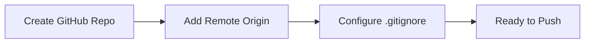
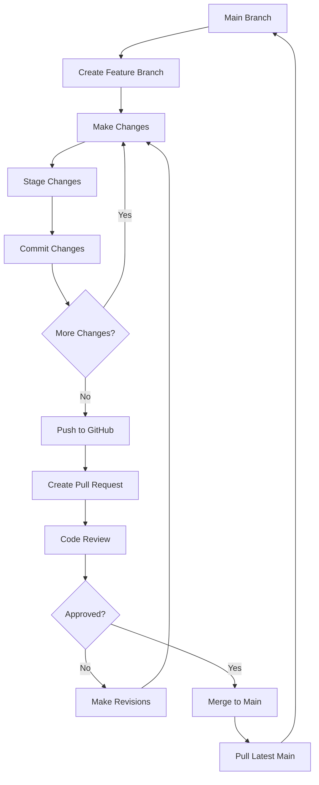
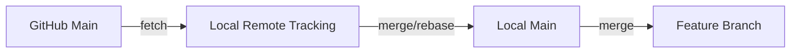

# Git-GitHub Integration Workflow

## Visual Workflow

```
┌─────────────────────────────────────────────────────────────────┐
│                    LOCAL DEVELOPMENT                             │
│                                                                   │
│  ┌──────────────┐      ┌──────────────┐      ┌──────────────┐  │
│  │   Working    │      │   Staging    │      │    Local     │  │
│  │  Directory   │─────▶│     Area     │─────▶│  Repository  │  │
│  │              │ add  │   (Index)    │commit│   (Commits)  │  │
│  └──────────────┘      └──────────────┘      └──────┬───────┘  │
│                                                       │           │
└───────────────────────────────────────────────────────┼──────────┘
                                                        │
                                                        │ push
                                                        ▼
┌─────────────────────────────────────────────────────────────────┐
│                         GITHUB                                   │
│                                                                   │
│  ┌──────────────┐      ┌──────────────┐      ┌──────────────┐  │
│  │   Feature    │      │     Pull     │      │     Main     │  │
│  │   Branch     │─────▶│   Request    │─────▶│    Branch    │  │
│  │              │  PR  │   (Review)   │merge │  (Production)│  │
│  └──────────────┘      └──────────────┘      └──────┬───────┘  │
│                                                       │           │
└───────────────────────────────────────────────────────┼──────────┘
                                                        │
                                                        │ pull
                                                        ▼
┌─────────────────────────────────────────────────────────────────┐
│                    TEAM COLLABORATION                            │
│                                                                   │
│  ┌──────────────┐      ┌──────────────┐      ┌──────────────┐  │
│  │  Developer   │      │  Developer   │      │  Developer   │  │
│  │      A       │      │      B       │      │      C       │  │
│  └──────────────┘      └──────────────┘      └──────────────┘  │
│                                                                   │
└─────────────────────────────────────────────────────────────────┘
```

## Complete Integration Flow

### 1. Initial Setup (One-Time)



**Commands:**
```bash
# Create repo on GitHub (via web or CLI)
gh repo create Master_Input --private

# Add remote
git remote add origin https://github.com/username/Master_Input.git

# Verify
git remote -v
```

### 2. Feature Development Workflow



**Commands:**
```bash
# 1. Create feature branch
git checkout -b feature/new-feature

# 2. Make changes, then stage
git add file1.py file2.py

# 3. Commit
git commit -m "feat: add new feature"

# 4. Push to GitHub
git push -u origin feature/new-feature

# 5. Create PR (via GitHub UI or CLI)
gh pr create --title "feat: New Feature" --body "Description"

# 6. After merge, update local main
git checkout main
git pull origin main

# 7. Delete feature branch (optional)
git branch -d feature/new-feature
git push origin --delete feature/new-feature
```

### 3. Pull Request Workflow

```
Developer                    GitHub                      Reviewer
    │                           │                            │
    ├─── Push Feature Branch ──▶│                            │
    │                           │                            │
    ├─── Create PR ────────────▶│                            │
    │                           │                            │
    │                           ├─── Notify Reviewer ───────▶│
    │                           │                            │
    │                           │◀─── Review Code ───────────┤
    │                           │                            │
    │                           ├─── Request Changes ───────▶│
    │◀─── Notification ─────────┤                            │
    │                           │                            │
    ├─── Make Changes ─────────▶│                            │
    │                           │                            │
    │                           ├─── Re-review ─────────────▶│
    │                           │                            │
    │                           │◀─── Approve ───────────────┤
    │                           │                            │
    │                           ├─── Merge to Main           │
    │                           │                            │
    │◀─── Merge Notification ───┤                            │
    │                           │                            │
```

### 4. Sync Workflow (Keeping Up-to-Date)



**Commands:**
```bash
# Fetch latest from GitHub
git fetch origin

# Update local main
git checkout main
git pull origin main

# Update feature branch with latest main
git checkout feature/your-branch
git merge main
# OR
git rebase main

# Push updated feature branch
git push origin feature/your-branch
```

### 5. Conflict Resolution Workflow

```
1. Fetch latest changes
   ↓
2. Attempt merge/rebase
   ↓
3. Conflict detected? ──No──▶ Continue
   ↓ Yes
4. Open conflicted files
   ↓
5. Resolve conflicts manually
   ↓
6. Stage resolved files
   ↓
7. Complete merge/rebase
   ↓
8. Push to GitHub
```

**Commands:**
```bash
# When conflict occurs during merge
git status  # See conflicted files

# Edit files to resolve conflicts
# Look for markers: <<<<<<<, =======, >>>>>>>

# After resolving
git add resolved_file.py
git commit -m "fix: resolve merge conflicts"
git push origin feature/your-branch
```

## Branch Strategy

### Recommended Branch Structure

```
main (production)
  │
  ├── develop (integration)
  │     │
  │     ├── feature/dow-integration
  │     ├── feature/new-agent
  │     └── feature/ui-update
  │
  ├── hotfix/critical-bug
  └── release/v1.0.0
```

### Branch Naming Conventions

- `feature/*` - New features
- `bugfix/*` - Bug fixes
- `hotfix/*` - Critical production fixes
- `release/*` - Release preparation
- `docs/*` - Documentation updates
- `refactor/*` - Code refactoring
- `test/*` - Test additions/updates

## Common Workflows

### Daily Development

```bash
# Morning: Start work
git checkout main
git pull origin main
git checkout -b feature/my-task

# During day: Save progress
git add .
git commit -m "wip: progress on task"
git push origin feature/my-task

# End of day: Final commit
git add .
git commit -m "feat: complete task implementation"
git push origin feature/my-task
```

### Code Review Process

```bash
# Create PR
gh pr create --title "feat: My Feature" --body "Description"

# Address review comments
git add modified_files.py
git commit -m "fix: address review comments"
git push origin feature/my-task

# After approval and merge
git checkout main
git pull origin main
git branch -d feature/my-task
```

### Emergency Hotfix

```bash
# Create hotfix from main
git checkout main
git pull origin main
git checkout -b hotfix/critical-issue

# Fix and test
git add fixed_file.py
git commit -m "fix: resolve critical issue"

# Push and create PR
git push -u origin hotfix/critical-issue
gh pr create --title "hotfix: Critical Issue" --body "Urgent fix"

# After merge
git checkout main
git pull origin main
git branch -d hotfix/critical-issue
```

## Git Commands Reference

### Essential Commands

| Command | Purpose |
|---------|---------|
| `git status` | Check current state |
| `git add <file>` | Stage changes |
| `git commit -m "msg"` | Commit changes |
| `git push` | Upload to GitHub |
| `git pull` | Download from GitHub |
| `git checkout <branch>` | Switch branches |
| `git branch` | List branches |
| `git merge <branch>` | Merge branches |
| `git log` | View history |
| `git diff` | Show changes |

### Advanced Commands

| Command | Purpose |
|---------|---------|
| `git rebase <branch>` | Reapply commits |
| `git cherry-pick <commit>` | Apply specific commit |
| `git stash` | Temporarily save changes |
| `git reset --hard` | Discard all changes |
| `git revert <commit>` | Undo commit |
| `git tag v1.0.0` | Create version tag |
| `git fetch --prune` | Clean up remote refs |
| `git clean -fd` | Remove untracked files |

## GitHub CLI Commands

| Command | Purpose |
|---------|---------|
| `gh repo create` | Create repository |
| `gh pr create` | Create pull request |
| `gh pr list` | List pull requests |
| `gh pr view` | View PR details |
| `gh pr merge` | Merge pull request |
| `gh pr checkout` | Checkout PR locally |
| `gh issue create` | Create issue |
| `gh workflow run` | Trigger workflow |

## Best Practices

### Commit Messages

Follow conventional commits:
```
feat: add new feature
fix: resolve bug
docs: update documentation
style: format code
refactor: restructure code
test: add tests
chore: update dependencies
```

### Before Pushing

```bash
# 1. Check status
git status

# 2. Review changes
git diff

# 3. Run tests
pytest

# 4. Lint code
flake8 .

# 5. Then push
git push
```

### Keeping Clean History

```bash
# Squash commits before merging
git rebase -i HEAD~3

# Amend last commit
git commit --amend

# Clean up branches
git branch --merged | grep -v "\*" | xargs -n 1 git branch -d
```

## Troubleshooting

### Common Issues

**"fatal: remote origin already exists"**
```bash
git remote remove origin
git remote add origin <url>
```

**"Updates were rejected"**
```bash
git pull --rebase origin main
git push origin feature/branch
```

**"Merge conflict"**
```bash
# Edit conflicted files
git add resolved_files
git commit
```

**"Detached HEAD state"**
```bash
git checkout main
```

**"Permission denied (publickey)"**
```bash
# Use HTTPS instead of SSH
git remote set-url origin https://github.com/user/repo.git
```

## Resources

- **Git Documentation**: https://git-scm.com/doc
- **GitHub Docs**: https://docs.github.com
- **GitHub CLI**: https://cli.github.com/manual
- **Git Cheat Sheet**: https://education.github.com/git-cheat-sheet-education.pdf
- **Conventional Commits**: https://www.conventionalcommits.org/
