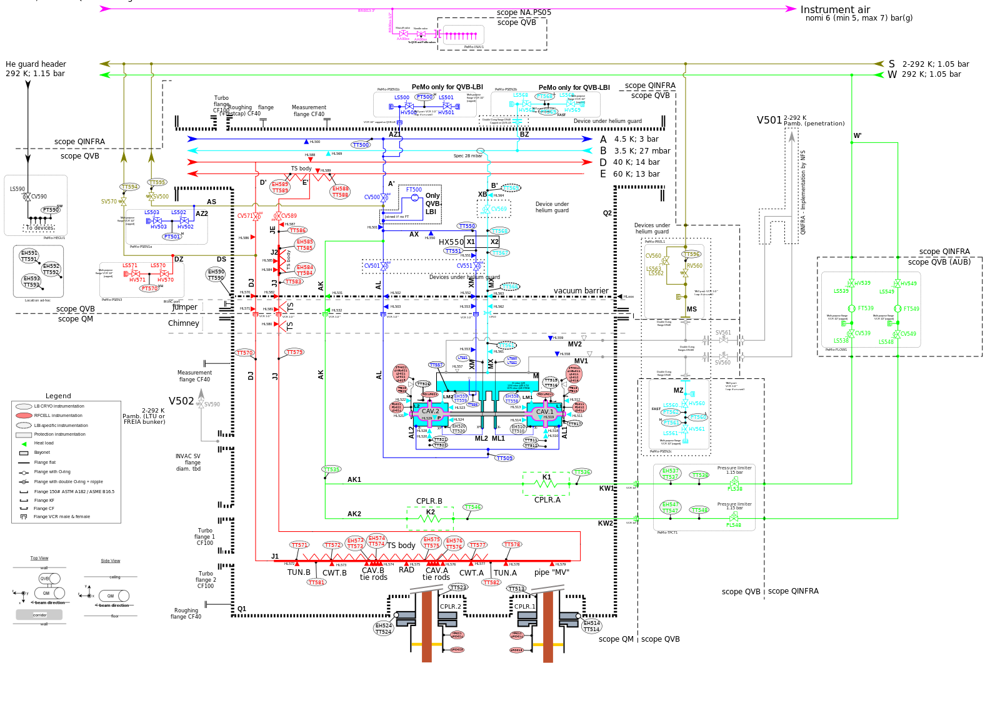
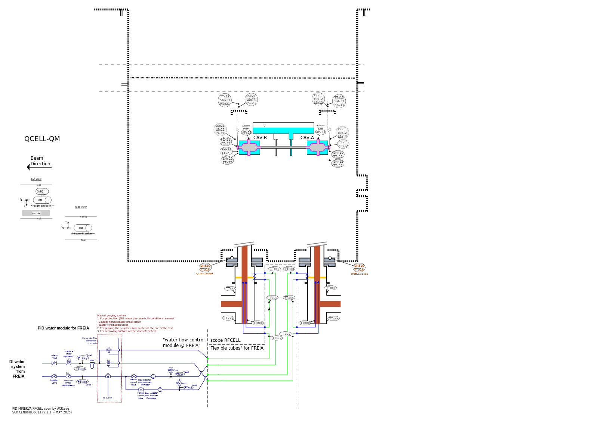

# P&ID SVG Inventory & Initial Analysis Report

**Project:** MINERVA — Flow Schemes and Instrumentation (P&ID reproduction to ISO / ISA 5.1)
**Generated:** 2026-06-03
**Source archives:**
- `02 - Flow schemes and Instrumentation.zip` (≈ 0.97 MB)
- `02 - Flow schemes and Instrumentation_Master.zip` (≈ 72.6 MB)

---

## 1. Extraction Summary

Both archives were unzipped into organized directories:

```
/home/ubuntu/pid_project/
├── extracted/
│   ├── standard/        # contents of "02 - Flow schemes and Instrumentation.zip"
│   └── master/          # contents of "...Instrumentation_Master.zip"
├── svg_source/          # de-duplicated working copies of the 2 unique SVGs
├── previews/            # rendered PNG previews of each SVG
├── analyze_svg.py       # analysis script
└── svg_inventory.md     # this report
```

### Archive contents

| File | standard.zip | master.zip | Type |
|------|:---:|:---:|------|
| PFD-PID MINERVA QCELL-LB.svg | ✅ | ✅ | **SVG (P&ID)** |
| PFD-PID MINERVA RFCELL seen by ACR.svg | ✅ | ✅ | **SVG (P&ID)** |
| MANIFEST_02 - Flow schemes and Instrumentation.html | ✅ | ✅ | Manifest |
| PID Nomenclature MINERVA CryoCell (QCELL-LB).xlsx | ✅ | ✅ | Tag nomenclature |
| QCELL - Auxilliary lines (NA.CP).xlsx | — | ✅ | Auxiliary line list |
| 2024-03-07 - Brainstorming QM instrumentation and controls.pptx | — | ✅ | Reference |
| PFD-PID of RFCELL - MASTER.pptx | — | ✅ | Source/master deck |
| PID MINERVA CryoCell (QCELL-LB).pptx | — | ✅ | Source deck |
| QSYS (and RFCELL) instrumentation location for LB and LBI.pptx | — | ✅ | Reference (65 MB) |

> **Note:** The two SVG files are byte-for-byte identical across both archives (verified by MD5).
> The `_Master.zip` additionally contains the editable PowerPoint sources and supporting Excel
> nomenclature/auxiliary-line lists, which will be valuable references for the standards-compliant
> reproduction.

### Unique SVG files found: **2**

| # | File name | MD5 | Size |
|---|-----------|-----|------|
| 1 | `PFD-PID MINERVA QCELL-LB.svg` | `788e30df…99e` | 1.70 MB |
| 2 | `PFD-PID MINERVA RFCELL seen by ACR.svg` | `d7fc4243…99b` | 0.96 MB |

---

## 2. SVG #1 — `PFD-PID MINERVA QCELL-LB.svg`

The primary, most detailed P&ID — the full QCELL / CryoCell cryogenic flow scheme with complete instrumentation.



### Document properties
| Property | Value |
|----------|-------|
| Internal docname | `PFD_MINERVA_QCELL-LB.svg` |
| Authoring tool | Inkscape 1.4 (2024-10-11) |
| SVG version | 1.1 |
| **viewBox** | `0 0 1527.2727 1080` |
| **Physical size** | `420 mm × 297 mm` (ISO **A3**, landscape) |
| File size | 1.70 MB |

### Structure & element counts
| Element | Count |
|---------|------:|
| Total elements | **3,463** |
| `path` | 1,029 |
| `tspan` | 663 |
| `g` (groups) | 586 |
| `text` | 459 |
| `marker` (arrow/line-end defs) | 336 |
| `circle` | 153 |
| `ellipse` | 118 (instrument bubbles) |
| `rect` | 75 |
| `use` | 24 |
| `image` | 3 (raster insets) |
| `pattern` / `clipPath` | 1 / 5 |

### Inkscape layers — **63 layers** (rich semantic segmentation already present)
The drawing is heavily layered. Key layer groups relevant to the segmentation goal:

- **Process / piping:** `Piping and series instrumentation` (×3), `Piping`, `Bottom line and common`,
  `6 - Main process line return + buffer tank (V)`, `5 - Main process line inlet + buffer tank (L)`,
  `4 - Coupler B intercept`, `3 - Coupler A intercept + common`
- **Items / components:** `Vacuum vessel` (×3), `2 K tank`, `CPLR 1`, `CPLR 2`, `CPLR circuit`,
  `CPLR cuff and port metal`, `CPLR pressure limiter`, `Bottom connection`, `Spare heaters`,
  `Flowmeter for AL`, `Headers A B C D`
- **Instrumentation:** `Instrumentation`, `Over-instrumentalization`, `Instrumentation Pcav Observer`,
  `Instrumentation naming zones`, `EH TT`, `EHTT`
- **Sub-systems / zones:** `RFCELL 1`, `RFCELL 2`, `INVAC` (×3), `QVB`, `QINFRA`, `QM - DUT at FREIA`,
  `QM - PeMo`, `He guard` (×2), `PeMo-HEGU1`, `Instrument air`, `Utilities NA.PS`, `Users`
- **Annotation:** `Namings`, `Naming and conditions`, `Comments` (×2), `General comments`,
  `Heat loads` (×2), `Terminal points`, `Legend`, `Versions`, `Scope division`, `pn levels`,
  `electrical`, `TC-LB`

### Text / labels / tags
- **566 text strings** present (labels, tags, notes, legend).
- **203 unique ISA-style instrument tags.** Tag-prefix histogram:

| Prefix | Meaning (ISA 5.1) | Count |
|--------|-------------------|------:|
| `TT` | Temperature Transmitter | 67 |
| `HL` | Heat Load annotation | 53 |
| `EH` | Electric Heater | 20 |
| `LS` | Level Switch | 17 |
| `HV` | Hand Valve | 12 |
| `CV` | Control Valve | 10 |
| `PT` | Pressure Transmitter | 9 |
| `SV` | Safety / Solenoid Valve | 6 |
| `CF` | (CF-flange callouts) | 6 |
| `LT` | Level Transmitter | 3 |
| `FT` | Flow Transmitter | 3 |
| `PL` | Pressure Limiter | 2 |
| `AA` | Analysis/Alarm | 2 |
| `RV` | Relief Valve | 1 |
| `HX` | Heat Exchanger | 1 |

- Sample component / equipment labels: `CAV.1`, `CAV.2`, `CPLR.1`, `CPLR.2`, `CPLR.A`, `CPLR.B`,
  `HX550`, `V501`, `V502`, `TUN.A/B`, `RAD`, `CWT.A/B`, `K1`, `K2`, `MV1`, `MV2`.

### Color palette — **67 unique hex colors** (process-line color coding present)
| Color | Hex | Uses | Likely meaning |
|-------|-----|-----:|----------------|
| ⬛ Black | `#000000` | 1144 | Outlines, generic structure, text |
| 🟦 Blue | `#0000ff` | 372 | Process line **A** (4.5 K; 3 bar) |
| 🟥 Red | `#ff0000` | 333 | Process line **D** (40 K; 14 bar) |
| 🟩 Green | `#00ff00` | 246 | Coupler water / utility lines |
| 🟦 Cyan | `#00ffff` | 194 | Process line **B** (3.5 K; 27 mbar) |
| 🫒 Olive | `#808000` | 160 | He-guard header (292 K; 1.15 bar) |
| 🟪 Magenta | `#ff00ff` | 151 | Instrument air |
| ⬜ White | `#ffffff` | 145 | Fills |
| Dark grey | `#1a1a1a` | 131 | Text/strokes |
| Light grey | `#f2f2f2` / `#999999` / `#808080` | 76 / 73 / 54 | Devices-under-vacuum, shading |
| 🟢 Dark green | `#008000` | 43 | QINFRA scope lines |
| Navy | `#000080` | 8 | — |
| Salmon | `#ffaaaa` / `#d35f5f` | 13 / 8 | RFCELL instrumentation bubbles |
| Amber | `#ffcc00` / `#f37f35` | 7 / 5 | Highlights / heat |

> The legend in the drawing explicitly defines line classes **A 4.5 K/3 bar, B 3.5 K/27 mbar,
> D 40 K/14 bar, E 60 K/13 bar**, plus instrument-class fills (LB CRYO, RFCELL, LBI-specific,
> Protection) and a **"vacuum barrier"** dashed boundary — directly matching the requested
> segmentation axes.

---

## 3. SVG #2 — `PFD-PID MINERVA RFCELL seen by ACR.svg`

A focused P&ID of the RFCELL water-flow / coupler module ("as seen by ACR"), including the
DI-water module for FREIA and the cavity/coupler detail.



### Document properties
| Property | Value |
|----------|-------|
| Internal docname | `PID MINERVA RFCELL seen by ACR.svg` |
| Reference | SCK CEN / 84836013 (v.1.3 — May 2025) |
| Authoring tool | Inkscape 1.4 |
| SVG version | 1.1 |
| **viewBox** | `0 0 1527.2727 1080` |
| **Physical size** | `420 mm × 297 mm` (ISO **A3**, landscape) |
| File size | 0.96 MB |

### Structure & element counts
| Element | Count |
|---------|------:|
| Total elements | **1,139** |
| `path` | 386 |
| `marker` | 221 |
| `tspan` | 166 |
| `g` (groups) | 126 |
| `text` | 78 |
| `circle` | 57 |
| `ellipse` | 39 (instrument bubbles) |
| `rect` | 31 |
| `use` | 10 |
| `image` | 3 |
| `pattern` / `clipPath` | 2 / 9 |

### Inkscape layers — **25 layers**
- **Components:** `CPLR A`, `CPLR B`, `Tee A`, `Tee B`, `coldmasses`, `CAV`, `CPLR`,
  `CPLR water loops`, `CPLR flange heater`, `Tubes for FREIA`, `Green pipes`
- **Piping/process:** `RFCELL`, `RF tee anti-freeze`, `Green pipes`
- **Instrumentation:** `Instrumentation`, `EH TT` (×2), `CPLR AD, ED, PT`, `RF Tee monitoring (FREIA)`
- **Zones/annotation:** `background`, `TUN`, `Legend`, `Comments`, `Comment`, `Scopes`, `Version`

### Text / labels / tags
- **128 text strings**; **45 unique ISA-style tags.** Prefix histogram:

| Prefix | Meaning (ISA 5.1) | Count |
|--------|-------------------|------:|
| `TT` | Temperature Transmitter | 23 |
| `LS` | Level Switch | 12 |
| `EH` | Electric Heater | 8 |
| `PT` | Pressure Transmitter | 6 |
| `PZ` | Pressure (special) | 4 |
| `AD` | Antenna/Analysis device | 4 |
| `SM` | — | 2 |
| `RS` | — | 2 |
| `AP` | Antenna Probe | 2 |
| `SV` | Safety Valve | 2 |
| `ED` | — | 2 |

- Note the **`x` placeholder** in tag names (e.g. `TTx21`, `EHx11`, `LSx12`, `PZx21`) — this drawing
  uses a generic/templated numbering scheme for the two symmetric cavity strings (A/B).
- Equipment labels: `CAV.A`, `CAV.B`, `QCELL-QM`, plus notes on the manual purging system.

### Color palette — **26 unique hex colors**
| Color | Hex | Uses | Likely meaning |
|-------|-----|-----:|----------------|
| ⬛ Black | `#000000` | 453 | Outlines, text |
| Navy | `#000080` | 146 | Water-loop / process line |
| 🟦 Blue | `#0000ff` | 92 | Process line |
| Dark grey | `#4d4d4d` | 65 | Structure |
| ⬜ White | `#ffffff` | 64 | Fills |
| 🟥 Red | `#ff0000` | 59 | Heater / hot line |
| 🟩 Green | `#00ff00` | 48 | Coupler water lines (to FREIA) |
| Light grey | `#f2f2f2` | 43 | Shading |
| 🟢 Dark green | `#008000` | 34 | Green pipes / scope |
| 🟦 Cyan | `#00ffff` | 24 | Cold line |
| Brown | `#aa4400` / `#bf512e` | 10 / 7 | Cavity/coupler bodies |
| Amber | `#ffcc00` / `#ff9a00` | 2 / 1 | Highlights |

---

## 4. Cross-Cutting Observations (relevant to the reproduction goal)

The requested segmentation axes map directly onto structures **already present** in the source SVGs,
which makes a clean, standards-compliant rebuild feasible:

| Requested segmentation | Source signal already in the SVGs |
|------------------------|-----------------------------------|
| **Main lines** | Color-coded line classes A/B/D/E + dedicated `Piping…`, `Main process line…` layers |
| **Individual items** | Equipment layers: `Vacuum vessel`, `2 K tank`, `CPLR 1/2`, `CAV`, `HX550`, `V501/V502` |
| **Components** | `CPLR circuit`, `CPLR cuff and port metal`, `CPLR water loops`, `Bottom connection` |
| **Sensors** | `ellipse`/`circle` instrument bubbles (118 / 39) + `Instrumentation` layers |
| **Instrumentation tags** | 203 + 45 unique ISA-style tags (`TT`, `PT`, `LT`, `LS`, `FT`, `EH`, `CV`, `HV`, `SV`, `RV`) |
| **Vacuum barrier** | Explicit dashed **"vacuum barrier"** boundary + `INVAC` layers |
| **Temperature** | `TT`/`LT` tags, `EH` heaters, `Heat loads`/`HL` annotations, cryo temperatures in legend |
| **Pressure** | `PT`/`PZ`/`PL`/`RV` tags, pressure values on each line class in legend |
| **Color segmentation** | 67 / 26 hex colors; line classes and instrument classes already color-keyed |

### Standards notes for the rebuild
- Both sheets are **ISO A3 landscape** with the same viewBox (`0 0 1527.2727 1080`), so a shared
  coordinate grid / template can be reused.
- Tags broadly follow **ISA 5.1** letter conventions (first letter = measured variable, e.g. T, P, L, F;
  trailing function letters T = transmitter, V = valve, S = switch). A normalization pass against the
  `PID Nomenclature MINERVA CryoCell (QCELL-LB).xlsx` will be needed to make tags fully ISA-consistent.
- Instrument **bubbles** are drawn as `ellipse`/`circle`; line-end **markers** (336 / 221) are heavily
  used for arrowheads, heat-load triangles, and flange symbols — these will need a clean symbol library.
- Color usage is currently RGB-primary (`#ff0000`, `#00ff00`, `#0000ff`, …). For an ISO/ISA reproduction
  a defined, documented color palette should replace the ad-hoc primaries.

---

## 5. Inventory at a glance

| # | SVG | Sheet size | viewBox | Elements | Layers | Text | Unique tags | Colors |
|---|-----|-----------|---------|---------:|-------:|-----:|------------:|-------:|
| 1 | PFD-PID MINERVA QCELL-LB | A3 (420×297 mm) | 0 0 1527.27 1080 | 3,463 | 63 | 566 | 203 | 67 |
| 2 | PFD-PID MINERVA RFCELL seen by ACR | A3 (420×297 mm) | 0 0 1527.27 1080 | 1,139 | 25 | 128 | 45 | 26 |

**Total: 2 unique P&ID SVG files**, both Inkscape-authored ISO A3 landscape drawings sharing a common
coordinate system, with existing semantic layering and color coding that align well with the planned
ISO / ISA 5.1 segmentation and reproduction work.
