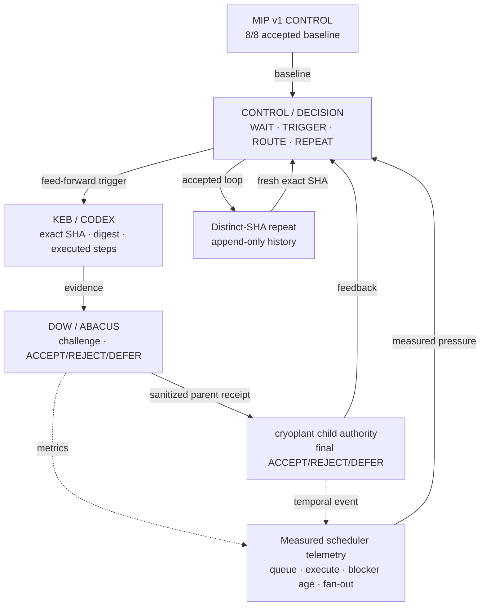
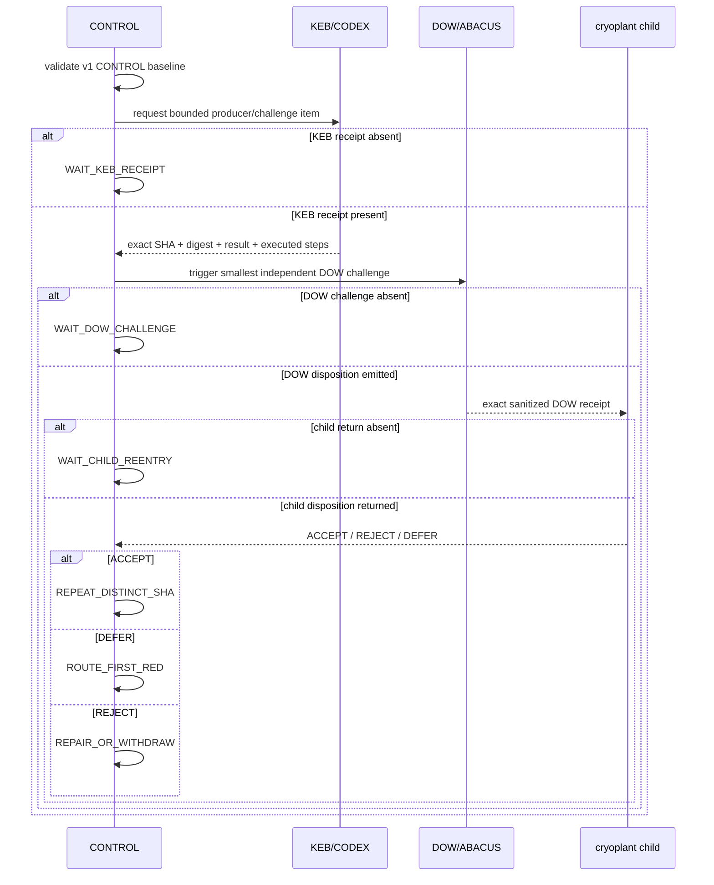

<!-- markdownlint-disable MD013 -->

# MIP v2 — Federated closed-loop control

Status: implementation pulse 1  
Predecessor: MIP v1 receipt-protection + exact-SHA self-index, 8/8 PASS -> CONTROL  
Scope: `mip_v2_federated_closed_loop_control`  
Fixed denominator: 10 gates

## Architectural intent

MIP v2 turns the accepted evidence layer into an explicit control loop. Feed-forward and feedback meet at CONTROL. Feedback never bypasses the controller and never directly mutates child engineering truth.

```text
V1 CONTROL BASELINE
        |
        v
+----------------------+       feedback       +----------------------+
| CONTROL / DECISION   |<---------------------| CHILD DISPOSITION    |
| wait/trigger/route   |                      | ACCEPT/REJECT/DEFER  |
+----------+-----------+                      +----------+-----------+
           | feed-forward                                ^
           v                                             | child re-entry
+----------------------+                                 |
| KEB PRODUCER         |                                 |
| exact SHA + digest   |                                 |
| executed steps       |                                 |
+----------+-----------+                                 |
           | evidence                                    |
           v                                             |
+----------------------+          DOW receipt             |
| DOW CONSUMER         |---------------------------------+
| challenge / project  |
| ACCEPT/REJECT/DEFER  |
+----------+-----------+
           |
           +--> sanitized metrics / temporal event --> CONTROL
```

## Flow semantics

- Feed-forward: CONTROL emits a bounded trigger, constraint or next action.
- Evidence: KEB/DOW execution emits exact-SHA sanitized evidence.
- Feedback: child or federation disposition returns to CONTROL before another action is selected.
- Wait: missing prerequisites are explicit controller states, not code failures.
- Blocker: an observed failed invariant returns to the first-red owner.
- Authority: only cryoplant child authority may create final QPS engineering/compliance disposition.

## Mermaid topology



## Controller sequence



## Gate model

| Gate | Target | First implementation disposition |
| --- | --- | --- |
| V2-G1 | Freeze v2 scope and 10-gate denominator | implemented in this pulse |
| V2-G2 | Import v1 8/8 CONTROL baseline | executable validation in this pulse |
| V2-G3 | Bind KEB, DOW and child contracts | bound by canonical repository locators and schemas |
| V2-G4 | Execute controller state machine | workflow + tests in this pulse |
| V2-G5 | Consume a real exact-SHA KEB receipt | WAIT real receipt |
| V2-G6 | Execute DOW challenge and emit disposition | WAIT G5 |
| V2-G7 | Child consumes exact DOW receipt | WAIT G6 |
| V2-G8 | Feedback selects bounded next action | WAIT G7 |
| V2-G9 | Measure scheduler pressure | planned; no seeded PCA may be relabelled as telemetry |
| V2-G10 | Repeat on distinct SHA and promote v2 loop to CONTROL | planned |

## Measurement rule

Node/edge pressure can continue to be shown as a seeded proxy for planning, but v2 promotion uses measured fields. Initial telemetry features are queue time, execute time, blocker age, dependency/fan-out count and outward-artifact impact. PCA is permitted only after sample adequacy and standardized measured features are available; otherwise use transparent BT/manual ranking and label it as such.

## Stop rule

Do not extend V2-G1..G10 after scope freeze. New repositories, agent fleets, broader MCP deployment or Grand Mission expansion require a separate versioned scope. A WAIT/DEFER is a valid bounded state and must not be converted to PASS for presentation.
