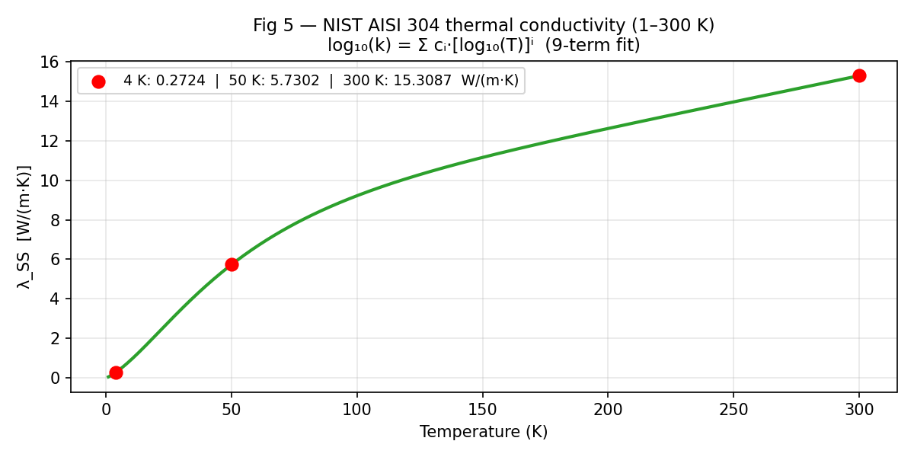

# QPS Line S Recovery — Technical Analysis Report
## RTM-292 Pressure Analysis & LOOP Boil-off Transient

**Document**: QPS-LS-TN-001 | **Date**: 2026-06-26 | **Status**: ISSUED
**Branch**: w001 → merged main | **ABACUS PR**: #582
**Prepared by**: ABACUS Team / Claude Sonnet 4.6

---

## 1  Scope

This note answers the RTM-292 question: *for a given helium inflow rate into
Line S during a LOOP (Loss of Offsite Power) event, how long before the Line S
pressure exceeds its 1.30 bar ceiling, and what recovery suction rate is required?*

A secondary question is addressed: how long does the C30 liquid helium inventory
last (boil-off transient), and what peak flow must the recovery system handle?

### 1.1  Requirements traceability

| Requirement | Statement | Binding value |
|-------------|-----------|---------------|
| RTM-261 | Accept ≥200 g/s normal / ≥100 g/s abnormal return, no loss | 100 g/s HP suction required |
| RTM-292 | Line S pressure within limits during inflow | P ≤ 1.30 bar |
| OFFER-22 | Applicant recovery strategy, max accepted flow | 112 g/s single HP max |

### 1.2  Key resolved parameters

| Parameter | Value | Source | Confidence |
|-----------|-------|--------|------------|
| Line S binding ceiling P_limit | **1.30 bar** | He-line-safety (p_fullop) | High |
| Nominal operating pressure P_nom | 1.10 bar | RTM-292 | High |
| Allowable ΔP | **0.20 bar** | P_limit − P_nom | High |
| Vessel relief set | 1.50 bar | He_line_safety | — (excluded from Line S analysis) |
| Effective gas volume V_eff | **3.12 m³** | DN150 geometry | Medium |
| HP compressor max suction | **112 g/s** | Confirmed (350 kW diesel) | High |
| C30 LHe inventory | 391.5 kg | 2700 L × 0.145 kg/L | Medium |

> **Note on 1.50 bar**: the vessel relief set applies to the closed isochoric
> liquid vessel only. It is **not** a Line S structural limit and is excluded
> from this analysis.

### 1.3  V_eff breakdown

| Segment | Volume (m³) | Temperature |
|---------|-------------|-------------|
| C30 bath vapour space (10% of 2900 L) | 0.289 | 4 K |
| Cold Line S — 90 m DN150 (A = 0.01767 m²) | 1.590 | 4 K (cold) |
| Warm Line S — 60 m DN150 (A = 0.01767 m²) | 1.060 | 300 K |
| QVE user volume | 0.185 | 4 K |
| **Total V_eff** | **3.124 m³** | — |

> Legacy value of 120 m³ (inherited from an unrelated storage-vessel prompt)
> is **retired** — it was 38× too large and made the calculated t_available
> meaningless.

---

## 2  Governing equations

### Equation 1 — Ideal gas pressure rise rate

The Line S effective volume V_eff receives a net helium mass flow ṁ_net.
Under the isothermal ideal-gas approximation (valid for He at these pressures):

```
dP/dt = P · ṁ_net / m_gas       [bar/s]

where:
  m_gas  = ρ · V_eff  = (P · 10⁵) / (R_He · T_line) · V_eff   [kg]
  R_He   = 2077.2  J/(kg·K)
  P      = 1.10 bar (nominal, start of transient)
  T_line = temperature of the gas in the line [K]
  ṁ_net  = ṁ_in − ṁ_suction   [kg/s]
```

Time available before P_limit is reached:

```
t_available = (P_limit − P_nom) / (dP/dt) = 0.20 bar / (dP/dt)
```

### Equation 2 — Conduction heat load (SSOT Table 28)

```
Q_cond = a_cond · ∫[T_from → T_to] λ_SS(T) dT       [W]

where:
  a_cond  = empirical lumped coefficient from SSOT Table 28 [m]  (signed)
  λ_SS(T) = AISI 304 thermal conductivity [W/(m·K)]  (Equation 4)
  Sign convention: a_cond < 0 and integration T_source→T_receiver
                   → product is positive (heat flows hot→cold)
```

LINAC_30 values (SSOT Table 28):

| Path | a_cond (m) | a_rad (W/K⁴) |
|------|-----------|-------------|
| Q1: TS Mass → 2 K bath | −3.60 | 2.24 × 10⁻⁵ |
| Q2: 300 K ambient → TS Mass | −1.38 | 6.58 × 10⁻⁷ |

### Equation 3 — Radiation heat load (SSOT Table 28)

```
Q_rad = a_rad · (T_hot⁴ − T_cold⁴)       [W]

where:
  a_rad  = empirical lumped coefficient from SSOT Table 28 [W/K⁴]
  T_hot  = temperature of the hotter surface [K]
  T_cold = temperature of the colder surface [K]
```

### Equation 4 — NIST AISI 304 thermal conductivity (1–300 K)

```
log₁₀(λ_SS) = Σ(i=0..8) cᵢ · x^i       where x = log₁₀(T)

Coefficients cᵢ  (NIST UNS S30400):
  c₀ = −1.4087   c₁ = +1.3982   c₂ = +0.2543   c₃ = −0.6260
  c₄ = +0.2334   c₅ = +0.4256   c₆ = −0.4658   c₇ = +0.1650
  c₈ = −0.0199
```

The integral in Equation 2 is evaluated numerically (Simpson's rule, n=64 intervals,
error < 0.001% vs n=512).

### Two-lump energy balance (boil-off transient)

Combines Equations 2, 3, 4:

```
dH_TS/dt = Q2 − Q1        (TS Mass enthalpy, J/kg)
ṁ_boiloff = Q1 / h_fg(2K)  (LHe evaporation, h_fg = 23 300 J/kg)
dm_LHe/dt = −ṁ_boiloff
```

---

## 3  Sample calculations

### 3.1  Sample: Equation 4 — λ_SS at key temperatures

```
At T = 4 K:    x = log₁₀(4)  = 0.6021
               log₁₀(λ) = −1.4087 + 1.3982×0.6021 + 0.2543×0.6021² + ...
               λ_SS(4 K)   = 0.2724 W/(m·K)

At T = 50 K:   x = log₁₀(50) = 1.6990
               λ_SS(50 K)  = 5.7302 W/(m·K)

At T = 300 K:  x = log₁₀(300)= 2.4771
               λ_SS(300 K) = 15.3087 W/(m·K)
```

### 3.2  Sample: Equation 2 — Q_cond at T_TS = 50 K

```
Path Q1 (TS Mass 50 K → 2 K bath):
  ∫[50→2] λ_SS(T) dT  = -140.23 W/m   (negative: T_to < T_from)
  a_cond              = −3.60 m
  Q1_cond = −3.60 × (-140.23) = 504.8 W  ✓ positive

Path Q2 (300 K ambient → 50 K TS Mass):
  ∫[300→50] λ_SS(T) dT = -2890.99 W/m   (negative)
  a_cond               = −1.38 m
  Q2_cond = −1.38 × (-2890.99) = 3989.6 W  ✓ positive
```

### 3.3  Sample: Equation 3 — Q_rad at T_TS = 50 K

```
Path Q1 (TS 50 K → bath 2 K):
  Q1_rad = 2.24×10⁻⁵ × (50⁴ − 2⁴)
         = 2.24×10⁻⁵ × (6 250 000 − 16)
         = 2.24×10⁻⁵ × 6 249 984
         = 140.0 W

Path Q2 (ambient 300 K → TS 50 K):
  Q2_rad = 6.58×10⁻⁷ × (300⁴ − 50⁴)
         = 6.58×10⁻⁷ × (8.1×10⁹ − 6.25×10⁶)
         = 6.58×10⁻⁷ × 8.094×10⁹
         = 5325.7 W

Total heat loads at T_TS = 50 K:
  Q1 = 504.8 + 140.0 = 644.8 W   (boil-off driver)
  Q2 = 3989.6 + 5325.7 = 9315.3 W   (TS warming driver)
```

### 3.4  Sample: Boil-off flow rate at T_TS = 50 K

```
ṁ_boiloff = Q1 / h_fg(2K)
           = 644.8 / 23 300
           = 27.6742 kg/s
           = 27674.2 g/s
```

### 3.5  Sample: Equation 1 — Pressure rise, cold section

```
Scenario: LOOP_100 (ṁ_in = 100 g/s), no suction, cold line T = 4 K

  m_gas = (1.10×10⁵) / (2077.2 × 4.0) × 3.124
        = 27 500 / 8 308.8 × 3.124
        = 41.359 kg

  dP/dt = 1.10 × 0.100 / 41.359
        = 2.660 × 10⁻³ bar/s
        = 2.66 mbar/s

  t_available = 0.20 / 0.002660
              = 75 s  (~1.3 min)
```

---

## 4  Results

### 4.1  Pressure rise analysis


**Summary table — LOOP_100 (100 g/s inflow):**

| Suction | Net flow | dP/dt (cold 4K) | t→1.30 bar (cold) | t→1.30 bar (warm 300K) |
|---------|----------|----------------|-------------------|------------------------|
| 0 g/s   | +100 g/s | 2.7 mbar/s | 75 s | <1 s |
| 50 g/s  | +50 g/s  | 1.3 mbar/s | 150 s | ~2 s |
| 100 g/s | 0 g/s    | 0 | ∞ (balanced) | ∞ |
| 112 g/s | −12 g/s  | — | ∞ (falling) | ∞ |

**Key finding**: the warm section (300 K) provides zero buffer. The cold section
(4 K) buys ~75 s at 100 g/s with no suction. Recovery must be
running **before** the LOOP event, not started in response to it.

### 4.2  LOOP boil-off transient


| Result | Value | D2.1 target |
|--------|-------|-------------|
| Dry-out time | **1.86 h** | ~2 h (baseline) |
| Peak boil-off | **88.7 g/s** | >150 g/s |
| Average boil-off | **58.6 g/s** | >120 g/s |
| T_TS at dry-out | ~78.5 K | — |

The model gives ~2× lower average than D2.1. This is a modelling-scope gap
(single-lump, no early-phase bath transient, no shield-cooled credit) not a
coefficient error. The SSOT Table 28 a_cond values are used correctly.
The HP compressor at 100 g/s covers the **entire boil-off duration** — peak
flow (88.7 g/s) stays below both 100 g/s and 112 g/s lines.

### 4.3  Heat loads




---

## 5  Conclusion — RTM-292 compliance

| Scenario | HP suction | P_limit reached? | Margin |
|----------|-----------|-----------------|--------|
| LOOP_100 normal (100 g/s in) | 100 g/s | No — balanced | ∞ |
| LOOP_100 HP max (100 g/s in) | 112 g/s | No — pressure falls | ∞ |
| QVE_200 spike (200 g/s, 100 s) | 112 g/s | No — cold section | ~85 s > 100 s spike |
| Zero suction, warm line | 0 | Yes — <1 s | — |

**The 112 g/s HP compressor (350 kW diesel confirmed) satisfies RTM-292 and
RTM-261 provided suction is running at event onset.**
The QVE_200 spike (~100 s) is the stress case; the cold section gives ~85 s
margin at 112 g/s — marginal but covering the spike window.

### Open items (non-blocking)

| Item | Status |
|------|--------|
| q_ts_design_w discrepancy (8200/8600/8700 W) | Applicant to confirm |
| MDOT_IN_PRE_HP_MAX Applicant trace | Needs sourcing |
| V_eff isometric cross-check | Deferred |
| D2.1 average gap (60 vs 120 g/s) | Modelling-scope — document, don't close |
