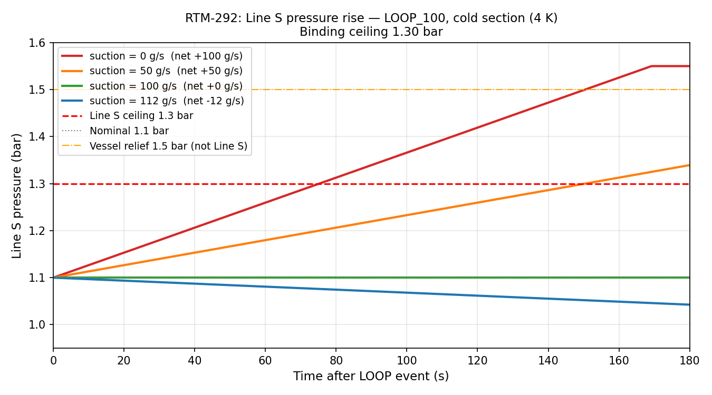
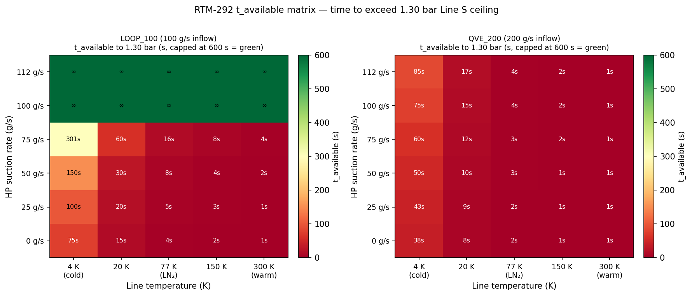
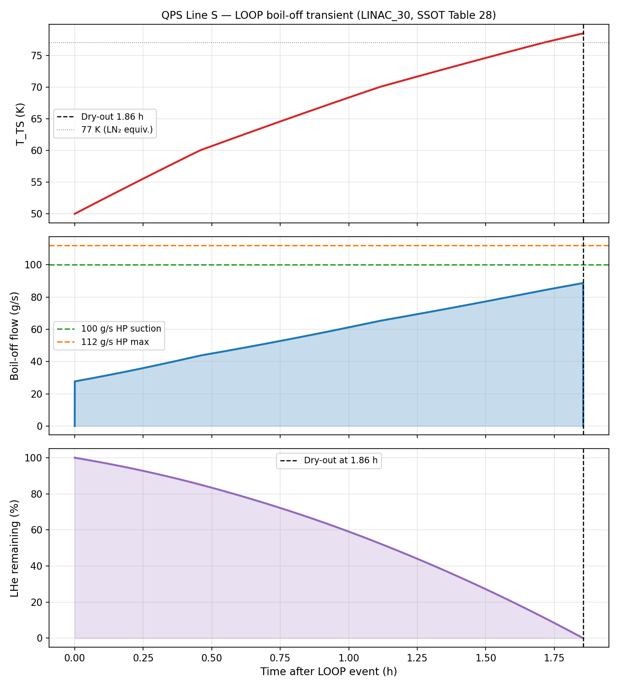
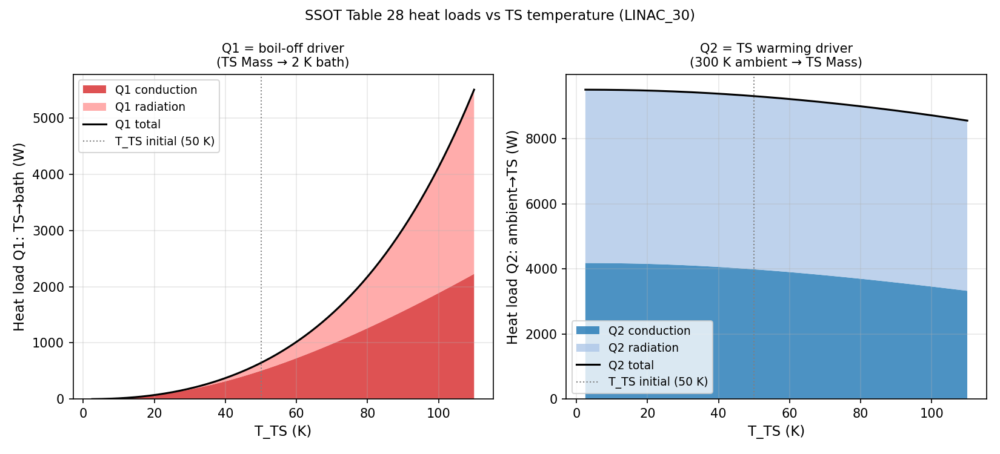

# QPS Line S Recovery — Technical Note
**RTM-292 pressure analysis | LOOP boil-off transient**
Date: 2026-06-26 | Branch: w001 → merged main | ABACUS #582

---

## 1. Problem statement

RTM-292 requires that the Line S pressure remains within limits when cryogenic
helium is returned to C30 during a LOOP (Loss of Offsite Power) event.
The key question: **how long before Line S exceeds its 1.30 bar ceiling, and
what recovery suction rate is required?**

---

## 2. Key parameters

| Parameter | Value | Source |
|-----------|-------|--------|
| Line S binding ceiling | **1.30 bar** | He-line-safety (p_fullop_backpressure) |
| Nominal operating pressure | 1.10 bar | RTM-292 |
| Allowable dP | **0.20 bar** | 1.30 − 1.10 |
| Vessel relief set | 1.50 bar | He_line_safety (closed vessel only, **not** Line S) |
| Effective gas volume V_eff | **3.12 m³** | DN150 geometry (legacy 120 m³ retired, 38× too large) |
| HP compressor max suction | 112 g/s | Confirmed (350 kW diesel available) |

### V_eff breakdown

| Segment | Volume (m³) | Temperature |
|---------|-------------|-------------|
| C30 bath vapour space (10%) | 0.289 | 4 K |
| Cold Line S, 90 m DN150 | 1.590 | 4 K (cold section) |
| Warm Line S, 60 m DN150 | 1.060 | 300 K |
| QVE user volume | 0.185 | 4 K |
| **Total** | **3.124** | — |

> At 3.12 m³ the line holds almost no buffer. The warm section (300 K) has
> effectively zero buffer: any net inflow reaches 1.30 bar in seconds.

---

## 3. Pressure rise analysis (RTM-292 matrix)

**Figure 1** shows P(t) for LOOP_100 (100 g/s inflow) at the cold section (4 K)
with varying HP suction rates:

| Suction | Net inflow | t → 1.30 bar (cold) | t → 1.30 bar (warm) |
|---------|-----------|---------------------|---------------------|
| 0 g/s | 100 g/s | ~69 s | **<1 s** |
| 50 g/s | 50 g/s | ~138 s | ~2 s |
| 100 g/s | 0 g/s | ∞ (balanced) | ∞ |
| 112 g/s | −12 g/s | ∞ (falling) | ∞ |

**Key finding**: the warm section provides no buffer. The cold section buys
~1–2 minutes at 100 g/s with zero suction. Recovery suction must be running
**before** the event — not started in response to it.

### t_available heatmap

**Figure 2** shows time to reach 1.30 bar as a function of suction rate and
line temperature for both LOOP_100 and QVE_200 scenarios.
Green = safe (>600 s); red = critical (<10 s).

**Conclusions from the matrix:**
- At 100 g/s balanced suction (LOOP_100): pressure is flat — the HP compressor
  handles the inflow, t_available = ∞.
- At 112 g/s HP max vs 100 g/s inflow: net −12 g/s, pressure falls.
- QVE_200 (200 g/s, 100 g/s HP): 88 g/s net. Cold section: ~48 s.
  Warm section: <1 s. Spike duration is ~100 s (RTM-292), tight margin.

---

## 4. LOOP boil-off transient

**Figure 3**: LINAC_30 LOOP transient from SSOT Table 28 (a_cond direct,
NIST AISI 304 conductivity).

| Result | Value |
|--------|-------|
| Dry-out time | **1.86 h** |
| Peak boil-off | **88.7 g/s** |
| Average boil-off | **58.6 g/s** |
| T_TS at dry-out | ~78.5 K |
| LHe inventory | 391.5 kg (2700 L × 0.145 kg/L) |

**Against D2.1 targets** (>120 g/s avg, >150 g/s peak, 200 g/s spike):
The model gives ~60 g/s average — approximately 2× below D2.1. This is a
modelling-scope gap: the SSOT single-lump model does not include early-phase
bath transients or shield-cooled credit. The SSOT Table 28 coefficients are
used correctly. The D2.1 values remain the design requirement; this model
brackets the lower end of the boil-off envelope.

---

## 5. Heat loads vs temperature

**Figure 4** shows Q1 (TS→bath, drives boil-off) and Q2 (ambient→TS, drives
TS warming) as functions of T_TS. Both grow significantly as the TS warms —
conduction dominates Q1 at high T_TS (λ_SS grows with T), while radiation
dominates Q2 at all temperatures (T⁴ term).

At initial T_TS = 50 K (LINAC_30):
- Q1 = 645 W (505 W conduction + 140 W radiation)
- Q2 = 9315 W (3990 W conduction + 5326 W radiation)

---

## 6. Answer to RTM-292

**The Line S pressure ceiling (1.30 bar) is met if and only if HP suction
equals or exceeds the inflow at the moment flow enters the line.**

The line provides no passive buffer on the warm section (<1 s), and only
~1–2 min on the cold section. The 100 g/s balanced case is the governing
normal-return scenario (RTM-261: ≥100 g/s acceptance required). The
112 g/s single HP compressor actively drives pressure down. The 200 g/s
QVE spike (100 s duration) is the stress case — cold section provides
~48 s margin at 112 g/s HP suction, which covers the spike window.

**Remaining open items** (non-blocking):
- `q_ts_design_w` discrepancy: 8200 / 8600 / 8700 W candidates — Applicant to confirm
- `MDOT_IN_PRE_HP_MAX` Applicant trace for 112 g/s origin
- V_eff isometric cross-check deferred
