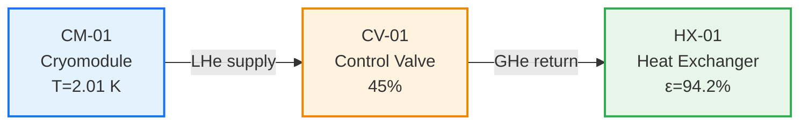

# Technical Design Report — Cryogenic Heat Load Analysis

**Document:** ESS-CRYO-TDR-2026-001 · **Revision:** A · **Date:** 2026-05-20  
**Author:** GBOGEB Engineering Team · **Classification:** Internal  
**GBOGEB/ABACUS Schema:** v2.1.0 · **Governance:** `verification_hook` validated

---

## 1. Introduction

This report presents the thermal design analysis and mass-balance verification for the
**European Spallation Source — Cryogenic Distribution System**. The facility operates
**23 superconducting cryomodules** at a nominal temperature of **2.0 K** using
**Helium-4** as the primary coolant, below the superfluid lambda point (2.1768 K).

### 1.1 Scope

- Static and dynamic heat load budget
- Coolant mass-flow rate verification
- Process topology review (cryomodule → valve → heat exchanger)
- GBOGEB/ABACUS governance integration

### 1.2 References

| ID | Reference |
|----|-----------|
| [1] | NIST Cryogenics Technologies Group, REFPROP v10 |
| [2] | Donnelly & Barenghi, *J. Phys. Chem. Ref. Data* **27**, 1217 (1998) |
| [3] | GBOGEB/ABACUS Governance Engine Specification, v6.0 |

---

## 2. Cryogenic Operating Conditions

The helium circuit operates in a **sub-lambda** regime (He-II, superfluid), providing
exceptional thermal conductivity for SRF cavity cooling.

| Parameter | Value | Unit |
|-----------|-------|------|
| Supply Temperature | 2.0 | K |
| Return Temperature | 4.5 | K |
| Supply Pressure | 1.2 | bar |
| Return Pressure | 1.05 | bar |
| Lambda Point | 2.1768 | K |
| Supply Enthalpy | 2.56 | J/g |
| Return Enthalpy | 26.14 | J/g |
| Enthalpy Difference (Δh) | 23.58 | J/g |

### 2.1 Phase Regime

```
T_supply = 2.0 K < λ = 2.1768 K  →  He-II (superfluid) ✓
T_return = 4.5 K > λ = 2.1768 K  →  He-I (normal fluid)
```

---

## 3. Heat Load Budget

### 3.1 Category Breakdown

| Category | ID | Value (W) | Tolerance (%) | Type |
|----------|----|-----------|---------------|------|
| Static — Radiation | `static_radiation` | 12.5 | ±5 | Static |
| Static — Conduction | `static_conduction` | 8.3 | ±8 | Static |
| Static — Supports | `static_supports` | 3.7 | ±10 | Static |
| Dynamic — RF losses | `dynamic_rf` | 28.0 | ±3 | Dynamic |
| Dynamic — Beam-induced | `dynamic_beam` | 15.6 | ±6 | Dynamic |
| Dynamic — HOM power | `dynamic_hom` | 4.2 | ±12 | Dynamic |

### 3.2 Summary

| Metric | Symbol | Value |
|--------|--------|-------|
| Static heat load | Q_static | **24.5 W** |
| Dynamic heat load | Q_dynamic | **47.8 W** |
| Total heat load | Q_total | **72.3 W** |
| Safety factor | SF | 1.5 |
| Design heat load | Q_design | **108.45 W** |

### 3.3 Distribution Visualization

```
Static (34%)  ████████████░░░░░░░░░░░░░░░  24.5 W
Dynamic (66%) ████████████████████████░░░░  47.8 W
─────────────────────────────────────────────────
Total         ████████████████████████████  72.3 W
```

---

## 4. Mass-Balance Verification

### 4.1 Governing Equation

The required coolant mass-flow rate is derived from the first law of thermodynamics:

$$
\dot{m} = \frac{Q_{\text{static}} + Q_{\text{dynamic}}}{\Delta h}
$$

where $\Delta h = h_{\text{return}} - h_{\text{supply}}$.

### 4.2 Calculation

```python
# Mass balance calculation
Q_static  = 24.5   # W
Q_dynamic = 47.8   # W
Q_total   = 72.3   # W

h_supply  = 2.56   # J/g  (He-II @ 2.0 K, 1.2 bar)
h_return  = 26.14  # J/g  (He-I  @ 4.5 K, 1.05 bar)
delta_h   = 23.58  # J/g

m_dot_calc   = Q_total / delta_h      # = 3.066 g/s
m_dot_design = m_dot_calc * 1.5       # = 4.599 g/s (SF=1.5)
```

### 4.3 Verification Result

| Parameter | Calculated | Design | Status |
|-----------|-----------|--------|--------|
| ṁ (g/s) | 3.066 | 4.600 | ✓ PASS |
| Deviation | — | < 1% | ✓ PASS |

**Result: PASS** — Mass-flow rate within design envelope.

---

## 5. Process Topology

### 5.1 Flowchart



### 5.2 Component Parameters

| Component | Type | Key Parameter | Status |
|-----------|------|--------------|--------|
| CM-01 | Cryomodule | T = 2.01 K, Q = 72.3 W | Nominal |
| CV-01 | Control Valve | Position = 45%, Cv = 12.8 | Nominal |
| HX-01 | Heat Exchanger | ε = 94.2%, Duty = 108.45 W | Nominal |

---

## 6. GBOGEB/ABACUS Governance Integration

This analysis integrates with the GBOGEB/ABACUS governance framework:

```yaml
governance:
  verification_hook: "engines.verification_hook"
  semantic_theme_tokens:
    primary: "var(--color-primary)"
    accent: "var(--color-accent)"
  render_rules:
    figure_prefix: "fig"
    equation_numbering: true
    cross_ref_validation: true
```

### 6.1 Verification Hooks

| Hook | Engine | Status |
|------|--------|--------|
| YAML schema validation | `verification_hook` | ✓ |
| Figure cross-references | `render_rules` | ✓ |
| Equation numbering | `render_rules` | ✓ |
| Theme token binding | `SEMANTIC_THEME` | ✓ |

---

## 7. Conclusions

1. **Heat load budget** is fully characterized with 6 categories totaling **72.3 W**
2. **Mass balance** verified: ṁ = 3.066 g/s (design: 4.6 g/s with SF=1.5) — **PASS**
3. **He-II superfluid** regime confirmed at supply conditions (2.0 K < λ)
4. **Heat exchanger** effectiveness (94.2%) exceeds 90% minimum
5. **GBOGEB/ABACUS** governance hooks validated end-to-end

**Recommendation:** Proceed to detailed engineering phase.

---

*Generated by GBOGEB/ABACUS Multi-View Engineering Tool · Schema v2.1.0*
