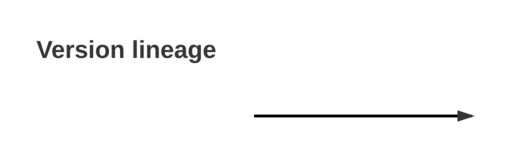

# Lineage Analysis — `<repo-name>`

**Phase:** 2 — DMAIC Measure
**Generated by:** `generate_lineage.py`
**Date:** YYYY-MM-DD

---

### 1. Summary

| Metric                 | Value |
| ---------------------- | ----: |
| Tags                   |       |
| Branches               |       |
| Abandoned branches     |       |
| Commits sampled        |       |
| First commit           |       |
| Latest commit          |       |

---

### 2. Version timeline

> Paste the Mermaid timeline produced by `generate_lineage.py`.

---

### 3. Feature evolution

| Feature             | First appears in | Removed / replaced in | Notes |
| ------------------- | ---------------- | --------------------- | ----- |
|                     |                  |                       |       |

---

### 4. Abandoned branches

| Branch | Last commit | Author | Action (delete / keep / merge) |
| ------ | ----------- | ------ | ------------------------------ |
|        |             |        |                                |

---

### 5. Decisions

- Which tags / branches are **canonical**?
- Which will be archived to `docs_versioned/`?
- Which will be deleted (with `pre-cleanup-snapshot` rollback)?
